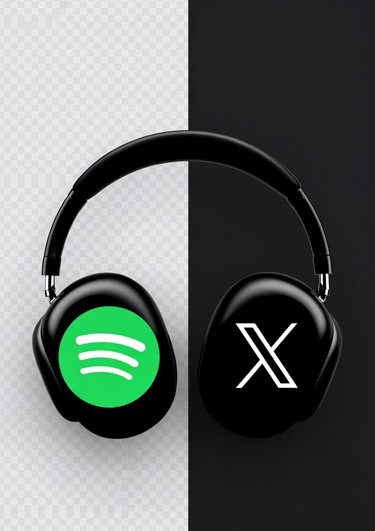

# dj-x-supercharged

<p align="center">
  
</p>

> **Turn what you scroll into what you stream.**
>
> X (Twitter) is where culture moves in real time — what artists drop, what your friends rave about, what the world is talking about. Spotify is where you actually listen. They've never spoken to each other. **dj-x-supercharged closes that loop.** Your liked tweets, your top artists' posts, your X "For You" interests — all turned into Spotify playlists and podcast picks that match what you're already paying attention to. Every doom-scroll becomes a playlist. Every clip becomes an episode. The two halves of how you spend your day, finally connected.

It scrapes signals (new releases, links, recommendations, mood, hosts, topics) from tweets and trends, weights them, and uses Spotify's search and your listening history to assemble custom-ranked playlists — no reliance on the deprecated `/v1/recommendations` endpoint.

> **Status:** alpha (`0.1.0`). API may change. PRs welcome.

## Why this exists

The old job-to-be-done: "find a song I'll like." Apps with a billion training examples already do that.

The job nobody's doing well: **"give me music that matches what I was just thinking about on social."** Five tabs of "best new rap albums of 2026", a Marco Rubio interview clip, a TikTok of an Indian wedding song, and a quote from Andrew Huberman on dopamine. dj-x-supercharged sees those signals (you liked them, the people you follow shared them, the trends suggest you care about them) and writes you a playlist that *is* that scroll. No "recommendation engine" in the abstract — just an engine for *your specific corner of the cultural internet today.*

---

## What you get

- A new private Spotify playlist named **"X + Spotify Hybrid Vibes - YYYY-MM-DD"**.
- Tracks weighted by how often a seed artist comes up across your top artists, their recent tweets, and your liked tweets.
- Pluggable tweet analyzer — default is **xAI Grok**, but you can swap in Claude, OpenAI, a local model, or a pure-regex implementation by subclassing `BaseAnalyzer`.

## Quickstart (60 seconds)

```bash
# 1. clone + install
pip install git+https://github.com/RenLes/dj-x-supercharged.git
# or for development:
git clone https://github.com/RenLes/dj-x-supercharged.git
cd dj-x-supercharged
pip install -e ".[dev]"

# 2. configure
cp .env.example .env
# fill in SPOTIFY_*, X_*, XAI_API_KEY

# 3. authorize
djx auth spotify
djx auth x

# 4. run
djx run --max-artists 5 --dry-run   # preview
djx run                              # create the playlist
```

## CLI

```text
djx run     [--max-artists 20] [--track-count 30] [--dry-run] [--public] [--no-llm]
djx daily   [--track-count 30] [--dry-run] [--public] [--no-llm]
djx weekly  [--track-count 50] [--dry-run] [--public] [--no-llm] [--no-scrape]
djx mood    [--hours 24] [--track-count 25] [--dry-run] [--public] [--no-llm]
djx viral   [--hours 48] [--track-count 25] [--dry-run] [--public] [--no-llm]

djx podcasts resolve  [--hours 24] [--resolve-max 10] [--no-llm]
djx podcasts daily    [--no-llm]
djx podcasts weekly   [--no-llm]
djx podcasts affinity
djx podcasts explain  "tweet text here"

djx auth spotify | x | status
djx clear-cache [--namespace x_user_tweets]
djx version
```

## Podcast Pulse

`djx podcasts` turns "I liked this clip" into "here's the full episode" — and learns your taste over time.

| Command | Does what |
|---|---|
| `djx podcasts resolve` | Scan recent likes/timeline → detect podcast clips → match each to a full Spotify episode → update affinity. |
| `djx podcasts daily` | Same as `resolve` but anchored on a 24h window. |
| `djx podcasts weekly` | 7-day window. |
| `djx podcasts affinity` | Print your top hosts, shows, and topics with 0–100 affinity scores and like counts. |
| `djx podcasts explain "tweet"` | Run the heuristic extractor on a single tweet — useful for debugging. |

**How affinity works.** Every detected clip writes events into `~/.djx/affinity.json`:
- `host` events for the detected podcast host (e.g. *Joe Rogan*)
- `show` events for the show
- `topic` events for each high-level topic the clip touches
Each event is recency-decayed (30-day half-life). Run `djx podcasts daily` regularly and the scores grow over time. Similar-host bonuses (e.g. liking *Lex Fridman* slightly boosts *Andrew Huberman*) are baked in via `host_score_with_similarity()`.

The clip-to-episode resolver searches Spotify with `host + guest + topic_hint`; if no episode matches, it falls back to the show's most recent episode.

## Playlists you can generate

| Command | What it builds | Window | Signals used |
|---|---|---|---|
| `djx run` | "X + Spotify Hybrid Vibes" | top 20 artists snapshot | per-artist tweet scrape + your likes |
| `djx daily` | **Daily Pulse** | last 24h | likes + home timeline + personalized trends + global/regional Viral 50 |
| `djx weekly` | **Weekly Resonance** | last 7 days | everything in daily + per-artist tweet scrape |
| `djx mood` | **Mood Mirror — \<mood\>** | last 24h (configurable) | dominant emotional tone → mood-matched search queries |
| `djx viral` | **Viral Surge** | last 48h | most-mentioned artists across timeline + likes, weighted heavily |

Each playlist's description includes the dominant mood, energy, regions detected, and trending artists — so you (and Spotify's UI) can see why it was built that way.

## Smart scenarios

The library implements these signal-driven behaviors automatically when you run `daily` / `weekly`:

1. **Mood Mirror** — Dominant mood across your tweets → matched genre/keyword search.
2. **Viral Surge Detector** — Artists mentioned ≥2× in last 48h get a +6 weight bump.
3. **Regional Echo** — Country mentions in your tweets/trends → blend that country's *Top 50* / *Viral 50* into the candidate pool.
4. **Artist Momentum** — Top artists tweeting heavily / announcing releases get extra seed weight in the weekly scrape.
5. **Event Soundtrack hooks** — `summarize_trends()` returns event signals (Super Bowl, election, festival, etc.). Wire them into `mood` if you want a soundtrack effect.

## Architecture

```
top artists ──┐
              ├─► seed pool ──► candidate expansion ──► scorer ──► playlist
artist tweets ┤        ▲                (Spotify)       (rank +
              │        │                                 diversity)
your likes ───┘     analyzer
                  (heuristic
                   + Grok LLM)
```

The pipeline is fully async, caches X responses on disk for 24h (rate limits are brutal), refreshes Spotify tokens on 401, and respects `Retry-After` on 429.

## Bring your own analyzer

Forkers can plug in any LLM in ~30 lines:

```python
from djx import BaseAnalyzer, TweetAnalysis, HybridAnalyzer

class ClaudeAnalyzer(BaseAnalyzer):
    async def analyze(self, tweet_text: str) -> TweetAnalysis:
        # call Anthropic SDK, parse JSON, return a TweetAnalysis
        ...

# Use it:
analyzer = HybridAnalyzer(llm=ClaudeAnalyzer())
```

See `examples/custom_analyzer_claude.py` and `examples/custom_analyzer_openai.py`.

To verify your subclass against the same suite the built-in analyzers pass:

```python
from tests.test_base_analyzer import analyzer_contract
import asyncio
asyncio.run(analyzer_contract(MyAnalyzer()))
```

## X (Twitter) API tier compatibility

| Tier        | Top-artist tweets | Your liked tweets | Notes                                              |
|-------------|-------------------|-------------------|----------------------------------------------------|
| Free        | ❌ 403            | ❌ 403            | Only top artists used; playlist still creates.     |
| Basic       | ✅                | ✅                | Recommended. ~10k reads/mo is enough for daily.    |
| Pro / higher| ✅ (no concern)   | ✅                | No constraints.                                    |

The X client detects 403s and degrades gracefully — you never get a hard crash from a tier limit.

## OAuth callback options

1. **Local loopback** (default): `djx auth …` opens your browser to a one-shot server on `127.0.0.1:8765`.
2. **Vercel fallback**: deploy `vercel/index.html` to any static host (Vercel, Netlify, GitHub Pages); set `DJX_VERCEL_FALLBACK_URL=…`. Useful when running over SSH or in a container.
3. **Manual paste**: with no fallback set, `djx` prints the auth URL and asks you to paste the redirect URL.

## Privacy / token storage

- OAuth tokens live at `~/.djx/tokens.json` with `chmod 0600`.
- API responses cache to `~/.djx/cache/`; clear with `djx clear-cache`.
- No analytics. No telemetry. No data leaves your machine except API calls to Spotify, X, and (optionally) xAI.

See [SECURITY.md](SECURITY.md) for vulnerability reporting.

## Development

```bash
pip install -e ".[dev]"
pytest                  # offline tests, no network
ruff check .            # lint
mypy djx                # types
```

## Contributing

PRs welcome. Read [CONTRIBUTING.md](CONTRIBUTING.md) first — it explains how to add a new analyzer, the test contract, and the PR checklist.

## Why not `/v1/recommendations`?

Spotify deprecated that endpoint for new/dev-mode apps in November 2024. We build seeds from top artists + tweet signals and expand via `search` + `related-artists` + `artist/top-tracks`. Score function lives in [`djx/recommender/score.py`](djx/recommender/score.py).

## License

MIT — see [LICENSE](LICENSE).
